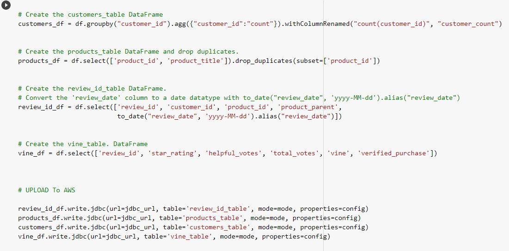
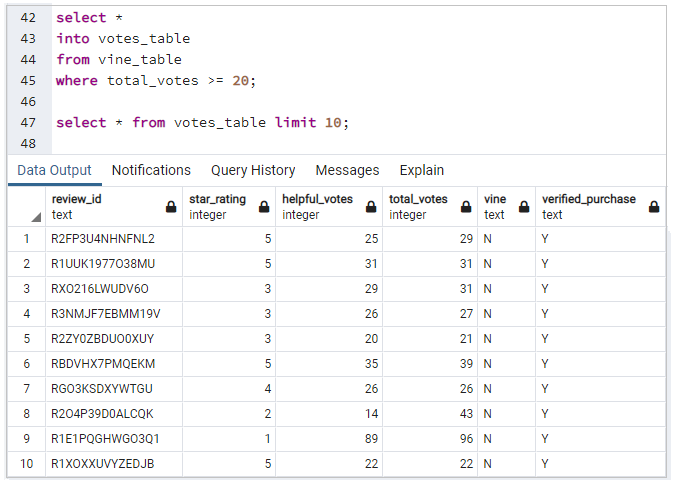
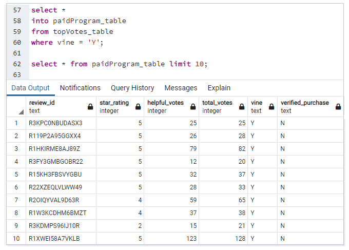
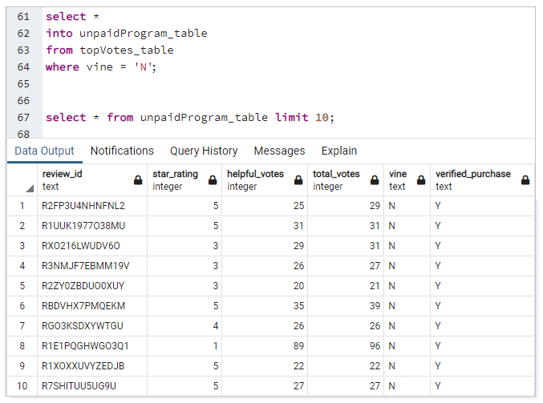
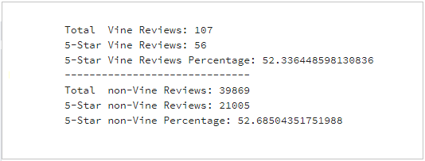

# Amazon Vine Analysis

Analyzing Amazon reviews written by members of the paid Amazon Vine program using PySpark, AWS, Google Colab Notebook and pgAdmin.  
The Amazon Vine program is a service that allows manufacturers and publishers to receive reviews for their products. Companies pay a small fee to Amazon and provide products to Amazon Vine members, who are then required to publish a review.

 

### Resources
- Data:&nbsp; [Amazon Review Dataset](https://s3.amazonaws.com/amazon-reviews-pds/tsv/index.txt),&nbsp; [Outdoors Review Dataset](https://s3.amazonaws.com/amazon-reviews-pds/tsv/amazon_reviews_us_Outdoors_v1_00.tsv.gz)
- Softwares:&nbsp; [Google Colab Notebook](https://colab.research.google.com/notebooks/welcome.ipynb),&nbsp; [pgAdmin](https://www.enterprisedb.com/downloads/postgres-postgresql-downloads),&nbsp; [AWS](https://aws.amazon.com/)

 

## Perform ETL on Amazon Product Reviews
We will transform the DataFrame into four separate DataFrames that match the table schema in pgAdmin. Then, we will upload the transformed data into the appropriate tables and run queries in pgAdmin to confirm that the data has been uploaded.

 

 

Queries to confirm that the data has been uploaded

 

 

## Determine Bias of Vine Reviews
For this analysis, we will determine if having a paid Vine review makes a difference in the percentage of 5-star reviews. 
 

First we pick reviews  that are more likely to be helpful.

 

 

In the next step we will retrieve all the rows where the number of helpful_votes divided by total_votes is equal to or greater than 50%.  

 

And then check if the reviews was or was not part of the Vine program.  

 

 

### Percentage of 5-star reviews

- **Vine and Non-Vine Program Reviews**

 

## Summary
The paid members with 52.34 percent and non-paid members with 52.69 percent show that having a paid Vine review doesn't makes a difference in the percentage of 5-star reviews for the outdoor equipments in Amazon market, and the companies can cancel this payment.

 

